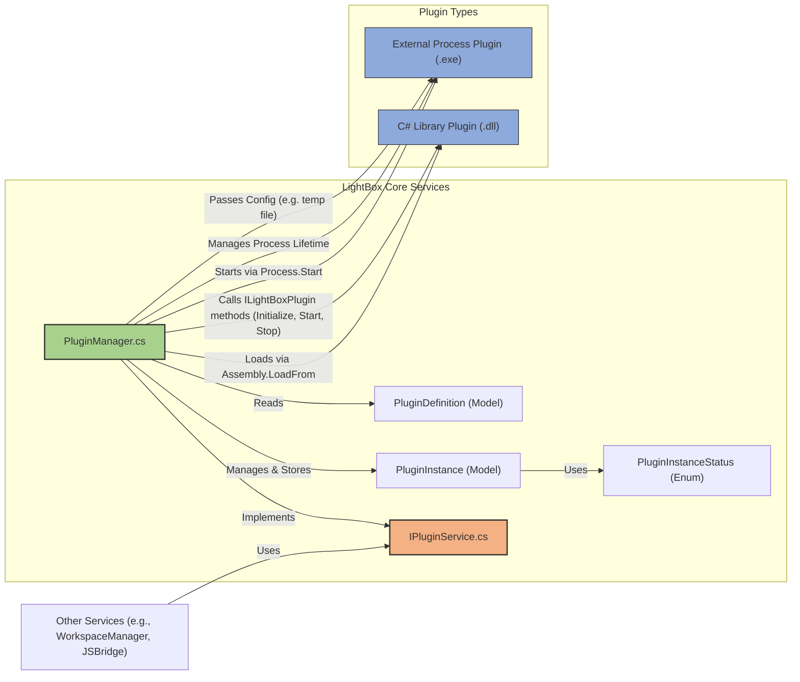

# LightBox 项目 - 阶段 1.1: 完善 PluginManager 实现 - 详细规划

本文档详细规划了 LightBox 项目开发计划中“阶段一：插件实例生命周期完善”的关键任务“1. 完善PluginManager实现”的细节。

## 1. 目标和范围

此阶段的目标是完善 `PluginManager`，使其能够有效地创建、加载、初始化、启动、停止和管理两类插件（C#库插件和外部进程插件）的实例，并跟踪它们的状态。

主要任务包括：
*   补充插件实例创建和管理功能。
*   实现C#库插件加载机制（使用 `Assembly.LoadFrom`）。
*   实现外部进程插件启动机制（使用 `Process`）。
*   添加插件实例状态跟踪。

## 2. 核心数据模型变更/新增

以下模型将在 `LightBox.Core/Models/` 目录下创建或修改：

*   **`PluginInstance.cs` (新增)**: 代表一个插件的运行实例。
    ```csharp
    // Path: LightBox.Core/Models/PluginInstance.cs
    using System;
    using System.Diagnostics; // For Process
    using LightBox.PluginContracts; // For ILightBoxPlugin

    namespace LightBox.Core.Models
    {
        public class PluginInstance
        {
            public string InstanceId { get; internal set; } // 由PluginManager生成和管理
            public string PluginId { get; internal set; } // 关联到 PluginDefinition.Id
            public string WorkspaceId { get; internal set; } // 所属工作区ID
            public PluginType Type { get; internal set; } // 从PluginDefinition获取
            public PluginInstanceStatus Status { get; internal set; }
            public string ConfigurationJson { get; internal set; } // 当前实例的配置
            public DateTime CreatedAt { get; internal set; }
            public DateTime? InitializedAt { get; internal set; }
            public DateTime? StartedAt { get; internal set; }
            public DateTime? StoppedAt { get; internal set; }
            public Exception LastError { get; internal set; } // 用于记录最后发生的错误

            // C# 库插件相关
            internal ILightBoxPlugin PluginObject { get; set; } 
            internal AppDomain PluginAppDomain { get; set; } // C#插件的独立AppDomain (可选，用于隔离和卸载)

            // 外部进程插件相关
            internal Process PluginProcess { get; set; }
            internal string TempConfigFilePath {get; set;} // 外部进程插件的临时配置文件路径

            public PluginInstance(string pluginId, string workspaceId, PluginType type, string configurationJson)
            {
                InstanceId = Guid.NewGuid().ToString(); // 生成唯一实例ID
                PluginId = pluginId;
                WorkspaceId = workspaceId;
                Type = type;
                ConfigurationJson = configurationJson;
                Status = PluginInstanceStatus.Created;
                CreatedAt = DateTime.UtcNow;
            }
        }
    }
    ```

*   **`PluginInstanceStatus.cs` (新增)**: 插件实例的状态枚举。
    ```csharp
    // Path: LightBox.Core/Models/PluginInstanceStatus.cs
    namespace LightBox.Core.Models
    {
        public enum PluginInstanceStatus
        {
            Unknown,      // 未知状态
            Created,      // 实例已创建，但未初始化/启动
            Initializing, // 正在初始化 (主要用于C#插件)
            Initialized,  // 已初始化 (主要用于C#插件)
            Starting,     // 正在启动
            Running,      // 正在运行
            Stopping,     // 正在停止
            Stopped,      // 已停止
            Disposing,    // 正在卸载/释放资源
            Disposed,     // 已卸载/释放资源
            Error         // 发生错误
        }
    }
    ```
*   **`PluginInstanceInfo.cs` (新增)**: 用于API返回的插件实例摘要信息。
    ```csharp
    // Path: LightBox.Core/Models/PluginInstanceInfo.cs
    using System;

    namespace LightBox.Core.Models
    {
        public class PluginInstanceInfo
        {
            public string InstanceId { get; set; }
            public string PluginId { get; set; }
            public string PluginName { get; set; } // 从PluginDefinition获取
            public PluginType Type { get; set; }
            public PluginInstanceStatus Status { get; set; }
            public string WorkspaceId { get; set; }
            public DateTime CreatedAt { get; set; }
        }
    }
    ```
*   **`PluginType.cs` (可能已存在或需在 `PluginDefinition.cs` 中定义/引用)**: 插件类型枚举。
    ```csharp
    // Path: LightBox.Core/Models/PluginType.cs (或者作为 PluginDefinition 的一部分)
    namespace LightBox.Core.Models
    {
        public enum PluginType
        {
            CSharpLibrary,
            ExternalProcess
        }
    }
    ```
    *   需要确保 `PluginDefinition.cs` 包含 `PluginType Type` 字段，以及加载插件所需的特定信息（如 `AssemblyPath`, `MainClass` for C#; `Executable`, `ArgsTemplate` for external process）。

## 3. 接口 (`IPluginService`) 变更

文件: `LightBox.Core/Services/Interfaces/IPluginService.cs`

将添加以下方法来管理插件实例的生命周期：

```csharp
// Path: LightBox.Core/Services/Interfaces/IPluginService.cs
using System.Collections.Generic;
using System.Threading.Tasks;
using LightBox.Core.Models;

namespace LightBox.Core.Services.Interfaces
{
    public interface IPluginService
    {
        Task<List<PluginDefinition>> DiscoverPluginsAsync(string scanPath = null); // scanPath 可选，若不提供则使用配置的路径

        // --- 新增插件实例管理方法 ---

        /// <summary>
        /// 根据插件定义ID和工作区ID创建插件实例。
        /// </summary>
        /// <param name="pluginId">插件定义ID。</param>
        /// <param name="workspaceId">工作区ID。</param>
        /// <param name="instanceName">插件实例的友好名称 (可选)。</param>
        /// <param name="initialConfigurationJson">插件实例的初始配置JSON字符串。</param>
        /// <returns>创建的插件实例信息。</returns>
        Task<PluginInstanceInfo> CreatePluginInstanceAsync(string pluginId, string workspaceId, string instanceName, string initialConfigurationJson);

        /// <summary>
        /// 初始化一个已创建的插件实例 (主要针对C#库插件)。
        /// </summary>
        /// <param name="instanceId">插件实例ID。</param>
        /// <returns>操作是否成功。</returns>
        Task<bool> InitializePluginInstanceAsync(string instanceId);
        
        /// <summary>
        /// 启动一个插件实例。
        /// </summary>
        /// <param name="instanceId">插件实例ID。</param>
        /// <returns>操作是否成功。</returns>
        Task<bool> StartPluginInstanceAsync(string instanceId);

        /// <summary>
        /// 停止一个插件实例。
        /// </summary>
        /// <param name="instanceId">插件实例ID。</param>
        /// <returns>操作是否成功。</returns>
        Task<bool> StopPluginInstanceAsync(string instanceId);

        /// <summary>
        /// 卸载/删除一个插件实例，释放其资源。
        /// </summary>
        /// <param name="instanceId">插件实例ID。</param>
        /// <returns>操作是否成功。</returns>
        Task<bool> DisposePluginInstanceAsync(string instanceId);

        /// <summary>
        /// 获取指定插件实例的状态。
        /// </summary>
        /// <param name="instanceId">插件实例ID。</param>
        /// <returns>插件实例的状态。</returns>
        Task<PluginInstanceStatus> GetPluginInstanceStatusAsync(string instanceId);

        /// <summary>
        /// 获取指定插件实例的详细信息。
        /// </summary>
        /// <param name="instanceId">插件实例ID。</param>
        /// <returns>插件实例的详细信息，如果找不到则返回null。</returns>
        Task<PluginInstanceInfo> GetPluginInstanceInfoAsync(string instanceId);
        
        /// <summary>
        /// 获取指定工作区的所有插件实例信息。
        /// </summary>
        /// <param name="workspaceId">工作区ID。</param>
        /// <returns>该工作区所有插件实例的信息列表。</returns>
        Task<IEnumerable<PluginInstanceInfo>> GetPluginInstancesByWorkspaceAsync(string workspaceId);

        /// <summary>
        /// 获取所有活动插件实例的信息。
        /// </summary>
        Task<IEnumerable<PluginInstanceInfo>> GetAllActivePluginInstancesAsync();

        /// <summary>
        /// (可选) 执行插件命令。此方法可能已在ILightBoxPlugin中定义，这里可能是对特定实例的包装调用。
        /// </summary>
        // Task<object> ExecutePluginCommandAsync(string instanceId, string commandName, object payload);
    }
}
```

## 4. `PluginManager` 实现细节

文件: `LightBox.Core/Services/Implementations/PluginManager.cs`

`PluginManager` 将实现 `IPluginService` 接口，并包含以下主要逻辑：

*   **插件实例存储**:
    *   使用 `private readonly ConcurrentDictionary<string, PluginInstance> _activeInstances = new ConcurrentDictionary<string, PluginInstance>();` 来线程安全地存储和管理活动的插件实例。
    *   需要依赖注入 `ILoggingService` 和 `IApplicationSettingsService` (用于获取插件定义等)。
    *   可能需要一个 `PluginDefinition` 的缓存或服务来快速获取插件定义。

*   **`CreatePluginInstanceAsync` 实现**:
    1.  验证 `pluginId` 是否存在 (从已发现的插件定义中查找)。
    2.  创建 `PluginInstance` 对象，设置初始状态为 `Created`，生成 `InstanceId`。
    3.  将 `PluginInstance` 对象添加到 `_activeInstances` 字典。
    4.  记录日志。
    5.  返回 `PluginInstanceInfo`。

*   **`InitializePluginInstanceAsync` 实现 (主要针对C#插件)**:
    1.  从 `_activeInstances` 获取 `PluginInstance`。检查状态是否为 `Created`。
    2.  如果插件类型是 `CSharpLibrary`:
        *   设置状态为 `Initializing`。
        *   **加载C#插件**:
            *   (可选，推荐) 创建新的 `AppDomain` 来加载插件，以便隔离和完全卸载。`pluginInstance.PluginAppDomain = AppDomain.CreateDomain(...)`
            *   使用 `Assembly.LoadFrom(pluginDefinition.AssemblyPath)` 在该 `AppDomain` 中加载程序集。 (如果使用 `AppDomain`, 需要通过代理调用)
            *   使用 `Activator.CreateInstance(assembly.GetType(pluginDefinition.MainClass))` 创建插件主类的实例 (`ILightBoxPlugin`)。
            *   `pluginInstance.PluginObject = (ILightBoxPlugin)instance;`
        *   **创建 `ILightBoxHostContext`**: 实例化 `LightBoxHostContext` (可能需要传递 `instanceId` 和其他服务给它)。
        *   **调用 `Initialize`**: `pluginInstance.PluginObject.Initialize(hostContext, pluginInstance.InstanceId, pluginInstance.ConfigurationJson);`
        *   更新状态为 `Initialized`，记录 `InitializedAt`。
        *   处理异常，如果失败则设置状态为 `Error` 并记录错误。
    3.  如果插件类型是 `ExternalProcess`，此方法可能只是简单地将状态更新为 `Initialized` 或直接返回 `true`，因为其初始化主要通过启动参数完成。
    4.  记录日志。

*   **`StartPluginInstanceAsync` 实现**:
    1.  从 `_activeInstances` 获取 `PluginInstance`。确保实例存在且状态合适（如 `Initialized` 或 `Stopped` 或 `Created` for external process）。
    2.  设置状态为 `Starting`。
    3.  **对于C#库插件 (`CSharpLibrary`)**:
        *   确保 `PluginObject` 已创建并已初始化。
        *   调用 `pluginInstance.PluginObject.Start();`
        *   更新状态为 `Running`，记录 `StartedAt`。
        *   处理异常，设置状态为 `Error`。
    4.  **对于外部进程插件 (`ExternalProcess`)**:
        *   获取 `PluginDefinition` 以拿到 `Executable` 和 `ArgsTemplate`。
        *   **准备临时配置文件 (如果需要)**: 如果插件配置复杂，可以将 `pluginInstance.ConfigurationJson` 写入一个临时文件，并将文件路径通过参数传递给插件。
            *   `pluginInstance.TempConfigFilePath = Path.Combine(Path.GetTempPath(), $"lightbox_plugin_{instanceId}_config.json");`
            *   `File.WriteAllText(pluginInstance.TempConfigFilePath, pluginInstance.ConfigurationJson);`
        *   **构造启动参数**: 替换 `ArgsTemplate` 中的占位符 (如 `{instanceId}`, `{configPath}`, `{apiEndpoint}`)。
        *   **启动进程**:
            *   `ProcessStartInfo startInfo = new ProcessStartInfo(pluginDefinition.Executable, formattedArgs);`
            *   设置 `WorkingDirectory`, `UseShellExecute = false`, `RedirectStandardOutput/Error` (如果需要日志)。
            *   `pluginInstance.PluginProcess = Process.Start(startInfo);`
            *   (可选) 监听进程的 `Exited` 事件以更新状态。
        *   更新状态为 `Running`，记录 `StartedAt`。
        *   处理启动异常，设置状态为 `Error`。
    5.  记录日志。

*   **`StopPluginInstanceAsync` 实现**:
    1.  从 `_activeInstances` 获取 `PluginInstance`。确保实例正在运行或处于可停止状态。
    2.  设置状态为 `Stopping`。
    3.  **对于C#库插件**:
        *   调用 `pluginInstance.PluginObject.Stop();`
        *   更新状态为 `Stopped`，记录 `StoppedAt`。
    4.  **对于外部进程插件**:
        *   如果 `pluginInstance.PluginProcess` 不为 `null` 且未退出:
            *   尝试正常关闭: `pluginInstance.PluginProcess.CloseMainWindow();` (如果它有UI)
            *   等待一段时间，如果未退出，则 `pluginInstance.PluginProcess.Kill();`
        *   更新状态为 `Stopped`，记录 `StoppedAt`。
        *   **清理临时配置文件**: `if (File.Exists(pluginInstance.TempConfigFilePath)) File.Delete(pluginInstance.TempConfigFilePath);`
    5.  处理异常，记录日志，状态可能仍为 `Error` 或 `Stopped`。

*   **`DisposePluginInstanceAsync` 实现**:
    1.  调用 `StopPluginInstanceAsync` 确保插件已停止。
    2.  设置状态为 `Disposing`。
    3.  **对于C#库插件**:
        *   如果 `PluginObject`实现了 `IDisposable`，则调用 `((IDisposable)pluginInstance.PluginObject).Dispose();`
        *   `pluginInstance.PluginObject = null;`
        *   如果使用了独立的 `AppDomain`，则卸载 `AppDomain`: `AppDomain.Unload(pluginInstance.PluginAppDomain); pluginInstance.PluginAppDomain = null;`
    4.  **对于外部进程插件**:
        *   确保进程已停止。 `pluginInstance.PluginProcess?.Dispose(); pluginInstance.PluginProcess = null;`
    5.  从 `_activeInstances` 字典中移除该实例: `_activeInstances.TryRemove(instanceId, out _);`
    6.  更新状态为 `Disposed`。
    7.  记录日志。

*   **状态获取方法 (`GetPluginInstanceStatusAsync`, `GetPluginInstanceInfoAsync`, `GetPluginInstancesByWorkspaceAsync`, `GetAllActivePluginInstancesAsync`)**:
    *   从 `_activeInstances` 查询并返回相应信息。
    *   对于 `PluginInstanceInfo`，需要从 `PluginDefinition` 获取 `PluginName`。

*   **错误处理和日志**:
    *   在每个操作的关键步骤使用 `try-catch` 块。
    *   发生异常时，更新 `PluginInstance.Status` 为 `Error`，并将异常信息存入 `PluginInstance.LastError`。
    *   使用注入的 `ILoggingService` 记录详细的操作日志、警告和错误。

## 5. Mermaid 图

下面是一个简化的Mermaid图，展示 `PluginManager` 的核心职责和它如何与插件实例及类型交互：



## 6. 需要在工作中考虑的问题

在具体实施过程中，以下几点需要进一步考虑和决策：

1.  **外部进程插件的初始化**: `ILightBoxPlugin` 接口中的 `Initialize` 方法主要针对C#插件。外部进程插件的初始化将主要通过启动时传递的参数（包括配置文件路径）完成。需要确认此方式是否能满足所有外部进程插件的需求，或者是否需要一种更通用的初始化信号机制。
2.  **`ILightBoxHostContext` 的具体内容和创建**: `PluginManager` 在加载C#插件并调用其 `Initialize` 方法前，需要创建并传递一个 `ILightBoxHostContext` 实例。该上下文具体需要暴露哪些主机功能给插件，需要根据插件的实际需求来详细定义。
3.  **C#插件卸载与资源清理**: MVP阶段可以考虑简化C#插件的卸载机制（例如，不强制使用独立的 `AppDomain`，接受插件DLL在主程序生命周期内可能无法完全卸载的限制），以加快开发进度。后续版本可以再引入更健壮的 `AppDomain` 隔离和卸载机制。
4.  **外部进程插件配置传递**: MVP阶段使用临时文件传递配置给外部进程插件是一种可行的方案。未来可以考虑更高级的IPC机制（如命名管道、HTTP回调）用于更动态的配置传递和通信。
5.  **错误恢复机制**: 当插件实例进入 `Error` 状态后，初步计划是记录错误并报告给用户。是否需要实现自动重试或更复杂的错误恢复逻辑，可以根据实际遇到的错误类型和频率来决定。