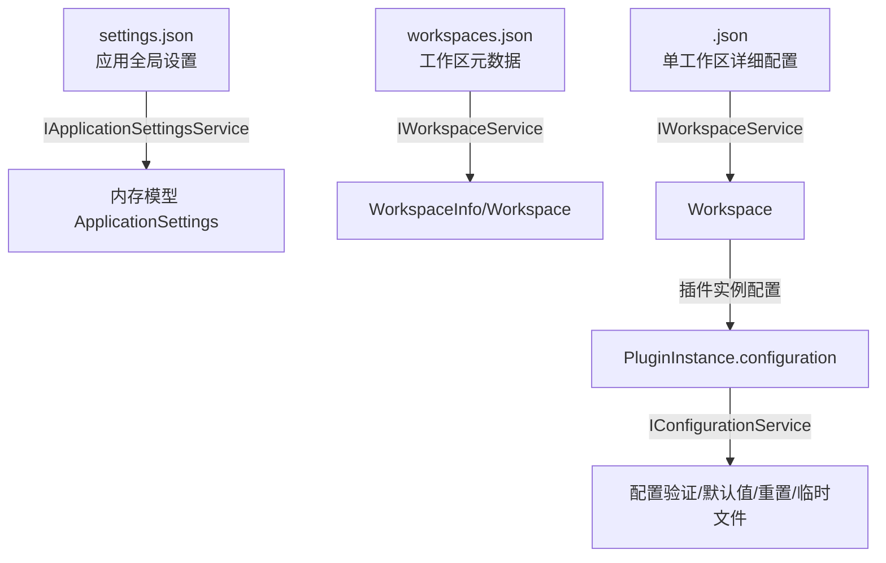
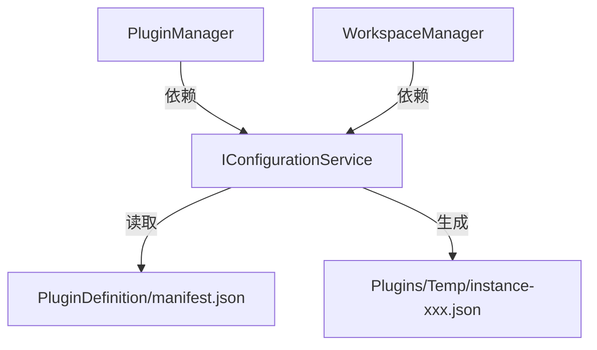

# LightBox 阶段1.2 配置管理实现细节文档

---

## 一、目标与范围

- **目标**：实现统一、可扩展的配置管理，覆盖全局应用设置、工作区配置、插件实例配置，支持配置验证、默认值、重置、外部进程插件临时配置文件生成等。
- **范围**：
  - 配置模型与序列化
  - 配置验证机制
  - 默认值与重置机制
  - 外部进程插件临时配置文件生成
  - 配置的持久化与加载
  - 配置的前后端交互接口

---

## 二、配置类型与存储结构



- **settings.json**：全局设置（插件扫描路径、日志、UI等），由 ApplicationSettingsService 管理。
- **workspaces.json**：工作区元数据列表。
- **<Workspace>.json**：单个工作区详细配置，含插件实例及其配置。
- **插件实例配置**：存储于 PluginInstance.configuration 字段，支持自定义结构。

---

## 三、涉及文件与内容明细

### 1. 新增文件

| 文件路径 | 主要内容 | 说明 |
|---|---|---|
| LightBox.Core/Services/Interfaces/IConfigurationService.cs | `public interface IConfigurationService`<br> - ValidateConfiguration(string pluginId, string configJson): 校验配置合法性<br> - GetDefaultConfiguration(string pluginId): 获取默认配置<br> - ResetConfiguration(string pluginId): 重置为默认配置<br> - GenerateTempConfigFile(string pluginId, string instanceId, string configJson): 生成临时配置文件，返回路径 | 插件配置验证、默认值、重置、临时文件生成等接口定义 |
| LightBox.Core/Services/Implementations/ConfigurationService.cs | `public class ConfigurationService : IConfigurationService`<br> - 实现上述接口方法<br> - 负责读取插件 manifest.json 的 config_schema 字段，进行 JSON Schema 验证、默认值生成、临时文件写入等 | 插件配置管理的具体实现 |
| LightBox.Core/Models/PluginConfigurationSchema.cs（可选） | `public class PluginConfigurationSchema`<br> - 用于描述和解析插件配置的 JSON Schema 结构 | 如需对 schema 结构做更强类型支持，可新增 |

### 2. 需修改的现有文件

| 文件路径 | 新增/修改内容 | 说明 |
|---|---|---|
| LightBox.Core/Models/PluginDefinition.cs | 新增/完善 `public string ConfigSchema { get; set; }` 字段 | 支持插件 manifest.json 中 config_schema 的读取与存储 |
| LightBox.Core/Services/Implementations/PluginManager.cs | 1. 注入 IConfigurationService 依赖<br>2. 在插件实例创建、初始化、启动等流程中调用配置验证、默认值、临时文件生成等方法 | 确保插件实例配置的正确性和外部进程插件的临时配置文件生成 |
| LightBox.Core/Services/Implementations/WorkspaceManager.cs | 如涉及插件实例配置的持久化/重置，需调用 IConfigurationService 的相关方法 | 保证配置变更时的统一校验与默认值处理 |
| LightBox.Core/Models/PluginInstance.cs | 确认/完善 `public string Configuration { get; set; }` 字段 | 存储插件实例的配置 JSON |
| LightBox.Core/Models/Workspace.cs | 确认/完善 PluginInstanceEntry 结构，支持插件实例配置的序列化 | 保证工作区配置的完整性 |
| LightBox.PluginContracts/manifest.json（插件示例） | 新增/完善 `config_schema` 字段 | 插件开发者需在 manifest.json 中声明配置 schema |

---

## 四、关键实现细节

### 1. 配置模型与序列化

- 所有配置均采用 `System.Text.Json` 序列化，使用驼峰命名、枚举字符串、格式化输出。
- 读写时采用临时文件+原子替换，失败时自动备份并恢复默认值。

### 2. 配置验证机制

- 插件 manifest.json 可定义 `config_schema`（JSON Schema）。
- IConfigurationService 提供 ValidateConfiguration(pluginId, configJson) 方法，校验配置合法性。
- 前端配置表单生成与后端验证保持一致。

### 3. 默认值与重置机制

- IConfigurationService 提供 GetDefaultConfiguration(pluginId) 方法，返回插件默认配置。
- 支持一键重置为默认配置。

### 4. 外部进程插件临时配置文件

- 启动外部进程插件时，IConfigurationService 生成临时配置文件（如 Plugins/Temp/instance-xxx.json），路径通过 args_template 传递。
- 启动前自动写入当前配置，插件进程读取。

### 5. 配置的持久化与加载

- 全局设置：IApplicationSettingsService.LoadSettingsAsync/SaveSettingsAsync
- 工作区配置：IWorkspaceService.GetWorkspaceAsync/SaveWorkspaceAsync
- 插件实例配置：随 Workspace 保存，变更时通过 WorkspaceManager 统一持久化

### 6. 配置的前后端交互

- WPF 层通过 LightBoxJsBridge 暴露 getApplicationSettings/saveApplicationSettings、updateWorkspace 等方法
- 前端通过 lightboxApi.js 调用，stores/settingsStore.js、workspaceStore.js 管理状态

---

## 五、依赖关系与调用流程



---

## 六、典型调用场景举例

### 插件实例创建时

1. PluginManager 调用 IConfigurationService.ValidateConfiguration 校验配置
2. 若为外部进程插件，调用 GenerateTempConfigFile 生成临时配置文件
3. 配置变更时，支持一键重置为默认值

### 配置表单前后端联动

1. 前端通过 API 获取插件 config_schema，动态生成表单
2. 提交配置时，后端再次校验，确保一致性

---

## 七、扩展与测试建议

- 支持插件配置 schema 热加载，便于插件升级。
- 配置变更自动保存与回滚机制。
- 单元测试覆盖：配置验证、默认值、序列化/反序列化、临时文件生成等。
- 前后端配置表单与后端 schema 校验保持一致，防止数据不一致。

---

## 八、接口方法示例（伪代码）

```csharp
// IConfigurationService.cs
public interface IConfigurationService
{
    ValidationResult ValidateConfiguration(string pluginId, string configJson);
    string GetDefaultConfiguration(string pluginId);
    string ResetConfiguration(string pluginId);
    string GenerateTempConfigFile(string pluginId, string instanceId, string configJson);
}

// ConfigurationService.cs
public class ConfigurationService : IConfigurationService
{
    // 读取 manifest.json，解析 config_schema，进行 JSON Schema 验证
    // 生成默认配置、重置配置
    // 在 Plugins/Temp/ 目录下生成 instance-xxx.json 临时配置文件
}
```

---

## 九、文件与职责一览表

| 文件 | 职责/内容 |
|---|---|
| LightBox.Core/Services/Interfaces/IConfigurationService.cs | 插件配置管理接口定义 |
| LightBox.Core/Services/Implementations/ConfigurationService.cs | 插件配置管理实现 |
| LightBox.Core/Models/PluginConfigurationSchema.cs（可选） | 插件配置 schema 结构描述 |
| LightBox.Core/Models/PluginDefinition.cs | 存储插件 config_schema |
| LightBox.Core/Services/Implementations/PluginManager.cs | 插件实例配置校验、临时文件生成 |
| LightBox.Core/Services/Implementations/WorkspaceManager.cs | 插件实例配置持久化、重置 |
| LightBox.Core/Models/PluginInstance.cs | 插件实例配置字段 |
| LightBox.Core/Models/Workspace.cs | 插件实例配置序列化 |
| LightBox.PluginContracts/manifest.json | 插件配置 schema 声明 |

